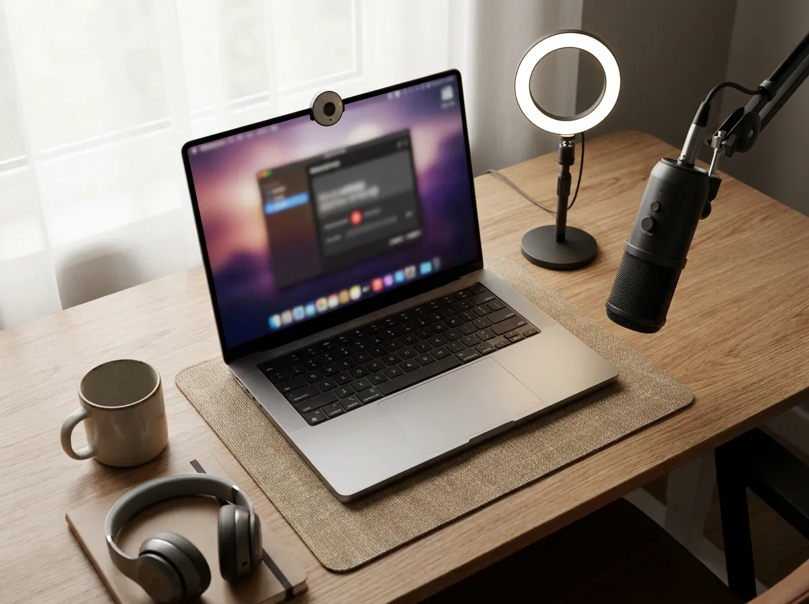

📌 Quick take
Loom's free plan caps you at 25 videos of 5 minutes each — fine for trying it, tight for actually working.

If you want truly free with no meter, OBS Studio, ShareX, Screenity, and QuickTime cost nothing forever. If you want Loom's record-and-share-a-link workflow, ScreenPal and Cap get closest on a budget.

Every "free" option has a catch — caps, watermarks, setup effort, or a trial pretending to be a plan. This guide names each one so you can pick once and move on.

People search for free Loom alternatives for one simple reason — the free plan runs out the moment your videos become part of how you work. I compared these tools on their public pricing and feature pages as of July 2026, and I'll be upfront about the method: I didn't lab-test every tier for months. This is a pricing-and-limits comparison plus hands-on familiarity with the mainstream options, with every number checkable on the official pages.

One more thing worth knowing before we start. Since the Atlassian acquisition, Loom's pricing has moved in one direction. In early 2026, multiple vendors reported that lightweight free team seats were phased out, pushing whole teams onto paid plans. Whether or not that hit you, it explains why "free Loom alternative" is suddenly a crowded search.

## What Loom's free plan actually gives you

Straight from the [Loom official pricing](https://www.loom.com/pricing) page as of July 2026: the free Starter plan includes **25 videos per person, 5 minutes per video, up to 720p**. Paid plans start at **$18 per user per month** for Business and **$24 for Business + AI**, with about 17% off on annual billing.

Read those limits against real usage. Five minutes covers a quick bug report, but a walkthrough or client update routinely runs longer — and the 25-video cap means your library starts deleting-or-upgrading conversations within a month or two of steady use. That's not an accident; it's the funnel. The alternatives below break that funnel in three different ways.

## The three kinds of "free" (know which one you're buying)

After opening a dozen comparison posts — most of them written by the vendors themselves — I found it helps to sort every option into three buckets.

| Kind of free | What it means | Examples |
| --- | --- | --- |
| Truly free, open source | No caps, no account, no upsell | OBS Studio, ShareX, Screenity |
| Free tier with limits | Usable forever, but capped or watermarked | ScreenPal, Vidyard, Cap |
| Free trial in disguise | "Free" ends in 7–14 days | Tella and most polished SaaS recorders |

The bucket matters more than the tool. If you record occasionally, a capped free tier is fine. If recording is part of your daily workflow, only the first bucket — or a cheap paid plan — actually removes the meter.

## Truly free, no meter — OBS, ShareX, Screenity, QuickTime

**OBS Studio** is the ceiling for free recording: unlimited length, full quality, no watermark, Windows/Mac/Linux. The trade-off is honest — it's a broadcast tool, so first-time setup takes longer, and there's no share link. You get a video file, and hosting it is your problem. For long-form tutorials it's unbeatable at the price of zero.

**ShareX** (Windows only) is the utility-belt version — capture, annotate, upload, all free and open source. **Screenity** is a free open-source Chrome extension that covers the annotate-while-recording use case surprisingly well. And if you're on a Mac and just need the pixels, **QuickTime Player** is already installed — File, New Screen Recording, done.

The pattern with this bucket: you trade convenience for freedom. None of these gives you Loom's instant share link with view tracking. What you get instead is no meter, ever.

## Free tiers that hold up — ScreenPal, Vidyard, Cap

If you want the record-then-send-a-link workflow, these free tiers are the ones I'd actually rely on, with their catches named. I dug into each plan page to see what's actually behind the paywall, and here's the honest read.

### ScreenPal — the closest free Loom feel

ScreenPal (web + desktop) replaces the core Loom loop: record, get a link, send it. Free recordings run up to 15 minutes, which already triples Loom's 5-minute cap, and there's no monthly video count to babysit.

The catch is a watermark on free exports. If that bothers you, paid plans start around $3/month — one of the cheapest exits from a watermark anywhere in this category. For quick internal updates where nobody cares about branding, the free tier alone covers most people.

### Vidyard — free, but built to upsell salespeople

Vidyard's free plan is reported at around 5 videos per month, with the view tracking that makes it popular for sales-style video messages. If your recordings are outreach — a pitch, a follow-up, a demo for a prospect — that tracking is genuinely useful.

The catch: five videos disappears fast, and the whole product steers you toward its sales tiers. As a general-purpose Loom replacement it runs out of road; as a light outreach tool it's fine.

### Cap — open source with a real cloud workflow

Cap is the closest open-source match to Loom's record-and-share experience, and the interesting part is the self-host option — your recordings can live on your own storage instead of someone else's cloud. Pro is about $8/month on yearly billing as of July 2026, roughly half of Loom Business.

The catch: it's a younger product than the incumbents, so expect rougher edges and a faster-moving changelog. For privacy-minded solo operators, that trade is often worth it.

Prices and caps in this bucket change often — confirm on the official page before you commit a team to any of them. Two names I left out deliberately: Dropbox Capture and Zight both have free tiers, but their limits shift frequently enough that I'd rather point you at the four above than quote numbers I can't stand behind.

## The free-trial traps to watch

A lot of "free Loom alternative" lists quietly include tools that are free for seven days. Tella is the usual example — a genuinely polished recorder, but its "free" is a 7-day trial and plans run in the $13–15/month range. That's not a knock on the product; it's a knock on the label. The same applies to most paid-only cinematic recorders like Screen Studio on Mac.

⚠️ Watch for
If a "free Loom alternative" asks for a credit card before you record anything, it's a trial, not a plan. Check the pricing page for the words "trial" or "for 7 days" before you build a workflow around it.

Here's the one I'd skip until you actually need it: any paid recorder, honestly. Record with a free tool for a month first. If you find yourself hitting caps weekly, you'll know exactly which paid feature you're buying — and if you're building out a broader budget stack, my [best AI tools for solo founders](/best-ai-tools-for-solo-founders/) guide and the [free Zapier alternatives](/free-zapier-alternatives-for-automation/) breakdown follow the same pay-only-when-it-hurts logic.

## Which one I'd pick, by situation

| Your situation | Pick | Why |
| --- | --- | --- |
| Quick async messages, hate setup | ScreenPal free | 15-min cap, instant link, watermark is bearable |
| Long tutorials, quality matters | OBS Studio | Unlimited and free forever, worth the setup hour |
| Chrome-first, light annotation | Screenity | Free, open source, lives where you work |
| Privacy or self-hosting matters | Cap | Open source, your storage, cheap Pro tier |
| Mac, one-off recording | QuickTime | Already installed, zero learning curve |

For most solo operators, the boring answer is a combination: ScreenPal or Screenity for quick shares, OBS for anything long. Total cost: zero.

## Frequently asked questions

**Q. What is the best completely free Loom alternative?**
A. OBS Studio, if you can spend an hour on setup — unlimited recording, no watermark, no account. If you want zero setup, Screenity (Chrome) and QuickTime (Mac) are the fastest truly free options.

**Q. What are Loom's free plan limits in 2026?**
A. As of July 2026, the official pricing page lists 25 videos per person, 5 minutes per video, and up to 720p quality on the free Starter plan.

**Q. Is there a free Loom alternative without a watermark?**
A. Yes — OBS Studio, ShareX, Screenity, and QuickTime add no watermark. Among link-sharing tools, watermark-free free tiers are rare; that's usually the first thing a paid plan removes.

**Q. Is Cap a good Loom replacement?**
A. It's the closest open-source match to Loom's record-and-share workflow, with a self-host option for privacy. It's a younger product though, so check the current state of its apps before moving a team over.

---

**Related keywords** — #loomalternatives #freeloomalternatives #screenrecording #obsstudio #screenpal #screenity #capso #quicktimescreenrecording #loomfreeplan #asyncvideo #screenrecorderfree #loompricing
