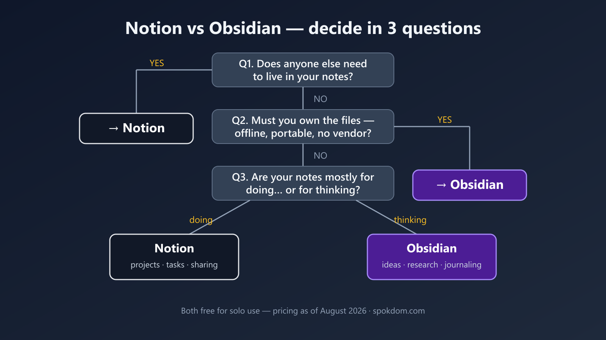

Here's the short version — Notion vs Obsidian for note taking is not a "which app is better" question. It's three questions about you: do other people need to live in your notes, do you want to own the files, and where will the free tier actually start charging you? Answer those and the winner picks itself in about two minutes.

Most comparisons don't do this. I opened the current top-ranking articles on this exact matchup, and the majority are written by competing note-app vendors quietly steering you toward a third product. The personal posts are honest but thin. So this one does the boring work instead: I compared both tools on their public pricing and feature pages as of August 2026, plus hands-on familiarity with both — not a 12-month lab test. Prices change, so confirm on the official pages before you pay.

📌 Quick take
Notion is a cloud workspace — best when notes are shared with a team, a client, or a co-founder, and you want databases and docs in one place.

Obsidian is a folder of Markdown files on your own device — best for a personal second brain you want to keep for decades, offline, with no vendor in the loop.

Both core apps are free for personal use. The real money question is Notion's per-member fee vs Obsidian's Sync add-on — mapped below.

## Notion vs Obsidian at a glance

The fastest way to see the difference is side by side. List prices below are as of August 2026, billed annually unless noted (monthly billing runs a little higher).

| | Notion | Obsidian |
|---|---|---|
| What it is | Cloud all-in-one workspace (docs, databases, projects) | Local-first Markdown note app |
| Where notes live | Notion's servers | Files on your device |
| Free plan | Yes — solo use is generous | Yes — full app, no sign-up |
| First paywall | Plus at $10/user/month (teams, bigger uploads) | Sync at $4–5/month (cross-device) |
| Collaboration | Real-time editing, comments, guests | Not built in — workarounds only |
| Offline | Partial, cloud-dependent | Fully offline by design |
| Customization | Templates, blocks | 2,000+ community plugins, CSS |
| Exit cost | Export, then rebuild structure | None — your notes are already plain files |

If a row above already settled it for you, you can stop reading. If not, the three questions below are how I'd actually decide.

## Question 1 — does anyone else need to live in your notes?

If the answer is yes, pick Notion and move on. This is the one gap Obsidian genuinely does not close: there is no built-in real-time collaboration. People bolt on workarounds with shared drives or Git, and they work about as well as that sounds — fine for two careful engineers, miserable for a normal team.

Notion, by contrast, was built for this. Real-time co-editing, comments, @mentions, and up to 10 external guests on the free plan. For a solo founder sharing a roadmap with a contractor, or a two-person team keeping ops docs in one place, that guest allowance alone often covers you before you pay anything.

The trap I'd flag: don't pick Notion "in case I collaborate someday." You can export and share a note from any tool on the day that actually happens. Pick for the workflow you have now, not the team you might hire next year.

## Question 2 — do you want to own the files?

If owning your notes matters to you, Obsidian wins this question outright. Your vault is a folder of plain Markdown files sitting on your own disk. It works fully offline, it opens in any text editor, and if Obsidian the company disappeared tomorrow, your notes wouldn't notice. For a second brain you intend to keep for ten or twenty years, that's not a nice-to-have — it's the whole bet.

Notion's model is the opposite: your notes live in their cloud, behind your account. The practical day-to-day cost is small — but the exit cost is real, and almost no comparison spells it out. Notion does let you export everything to Markdown and CSV, so you're not hostage. What you lose in the move is structure: databases flatten into CSV files, relations between them break, and nested pages arrive as a pile of folders. I'd describe Notion's lock-in as soft but sticky — you can leave, but you'll spend a weekend rebuilding.

Migrating the other way is easier. Obsidian's files are already Markdown, which is exactly what most tools import. That asymmetry is worth knowing before you put five years of notes into either app.

## Question 3 — where does the free tier actually charge you?

Both tools are honestly free for a solo note-taker — rare praise from me. But the paywalls sit in different places, and this is where most roundups get vague. Here's the map, from each tool's own pricing page as of August 2026.

**Notion's free plan** gives one person unlimited pages and blocks. The real limits are 5&nbsp;MB per file upload, 10 guests, 7 days of page history, and only a trial of Notion AI. The paywall moment is adding a second full member — blocks become limited and you're looking at Plus at $10 per user per month. Check the current numbers on [Notion's official pricing page](https://www.notion.so/pricing) before you commit.

**Obsidian's free app** has no feature limits at all, and since a 2025 policy change, even commercial use no longer requires a license (the $50/user/year commercial license is now optional support, which most older comparisons still get wrong). The paywall moment is wanting your vault on two devices — official Sync is $4/month billed annually ($5 monthly), and Publish is $8–10/month. Students and nonprofits get 40% off both. Plenty of people sync a vault free through iCloud or Syncthing instead; it works, but conflict handling is on you, so I'd treat official Sync as the honest price of a phone-plus-laptop setup.

## What a year actually costs a solo founder

Because "both are free" hides real differences, I dug into what a first year looks like in three common setups.

| Setup | Notion | Obsidian |
|---|---|---|
| One person, one device | $0 | $0 |
| One person, laptop + phone | $0 (cloud sync included) | $48/year (Sync, annual) — or $0 DIY |
| Two people sharing notes | $240/year (Plus, 2 seats, annual billing — monthly billing runs higher) | Not really supported |

Read that table twice and the pattern pops: Notion's free tier is strongest for a multi-device solo user, Obsidian's is strongest for a single-device purist, and the moment a second person joins, Notion is the only serious answer — at a real per-seat price. This per-seat math is the same reason I keep steering solo founders toward single-player tools in my [Airtable alternatives for solo founders](/airtable-alternatives-solo-founders/) breakdown — seat pricing is where small budgets quietly leak.

## Learning curve and day-to-day feel

Notion is easier on day one; Obsidian is calmer on day two hundred. Notion's slash-command editor lets you build a page with tables, toggles, and embeds in minutes, but the flexibility invites over-engineering — it's easy to lose an afternoon redesigning a dashboard instead of taking notes. Obsidian opens as an empty Markdown file. That's intimidating for about an hour, and then the plain-text simplicity becomes the point: no blocks to arrange, nothing to fiddle with, just typing and linking.

For studying or journaling specifically, I'd lean Obsidian — daily notes and backlinks fit the "write every day, connect later" habit, and the graph view rewards it. For project management with deadlines, databases, and views, that's Notion's home turf, and Obsidian needs plugins to fake it.

## What about AI?

As of August 2026, Notion has the cleaner built-in story: Notion AI can chat with your workspace, draft documents, and autofill databases — but the full version effectively lives on the Business plan at $20/user/month, with lower tiers getting a limited trial. Obsidian ships no first-party AI; instead, community plugins let you point tools like Copilot-style assistants or Claude at your vault with your own API key. More setup, but often cheaper, and your notes stay local. If built-in AI is your deciding factor, that's a point for Notion — just budget the Business tier, not the free one.

## The split most people actually land on

After all the "vs" framing, the most common real-world answer (and the one Reddit threads on notion vs obsidian keep converging on) is both, with a clean border. Shared, operational, deadline-driven material — client docs, project trackers, team wikis — goes in Notion. Personal thinking — a second brain, reading notes, journaling, drafts — goes in Obsidian, where it stays private, offline, and portable. The failure mode isn't picking the wrong app; it's letting the border blur and maintaining two half-hearted systems. Give each app a jurisdiction and the pairing costs $0 to try.

## What I'd skip

Two things, honestly. First, Notion AI on a personal plan — the trial runs out, and $20/month for note-summarizing is steep when solo note-taking was the whole job; add it only when it removes real work. Second, Obsidian plugin maximalism — installing thirty plugins on week one recreates the complexity you left Notion to escape. Start with core features and add a plugin only when you hit an actual wall.

## How to choose (the two-minute version)

Run the three questions in order. Someone else in your notes daily? Notion, done. Files you own for the long haul, offline, no vendor risk? Obsidian, done. Still tied — you're solo, cloud is fine, and you're choosing on feel? Take the free tier of each for one real week of your actual notes. The tiebreak that works: if your notes are mostly for doing (projects, tasks, sharing), pick Notion; if they're mostly for thinking (ideas, research, journaling), pick Obsidian. And if I had to hand one app to a random solo founder with no other context, I'd hand them Obsidian for notes and let Notion earn its seat the day a second person shows up.

## FAQ

**Q. Which is better for building a second brain, Notion or Obsidian?**
A. Obsidian, for most people. Backlinks, the local graph, and plain Markdown files suit a decades-long personal knowledge base, and there's no vendor dependency. Notion can do it, but its structure rewards databases over free-form linking.

**Q. Is Notion or Obsidian better for students and studying?**
A. Obsidian if your studying is reading, summarizing, and connecting ideas — daily notes plus backlinks fit that loop, and the education discount cuts Sync to about $2.40/month. Notion if you also manage assignments, deadlines, and group projects in the same place.

**Q. Can Obsidian replace Notion for project management?**
A. Only partially. Plugins like Kanban and Tasks get a solo user surprisingly far, but there are no real-time collaboration features, no native databases, and no comments. If projects involve anyone else, Notion (or a dedicated PM tool) is the right lane.

**Q. Is Obsidian really free? Where's the catch?**
A. The app is genuinely free with no feature limits, and since 2025 even commercial use doesn't require a license. The paid parts are optional services — Sync at $4–5/month and Publish at $8–10/month, as of August 2026. If you only use one device, you may never pay anything.

**Q. Which should I pick in 2026 if I'm leaving Evernote or OneNote?**
A. Match your old habit. Evernote and OneNote refugees who mostly clipped and searched tend to feel at home in Notion. If what you actually wanted was speed, plain text, and files you control, Obsidian is the upgrade — and its Markdown import makes the move painless.

---

**Related keywords** — #notionvsobsidian #notetakingapps #secondbrain #notionfree #obsidiansync #markdownnotes #personalknowledgemanagement #notionpricing #obsidianplugins #noteappsforstudents #notionai #obsidianpublish
